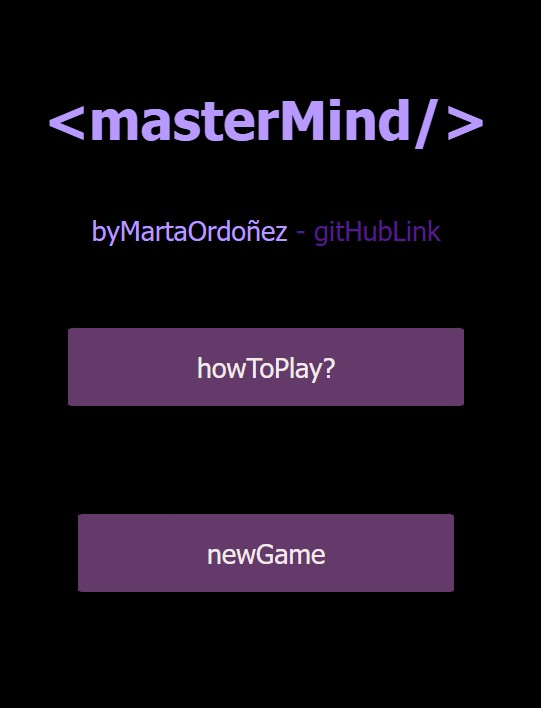
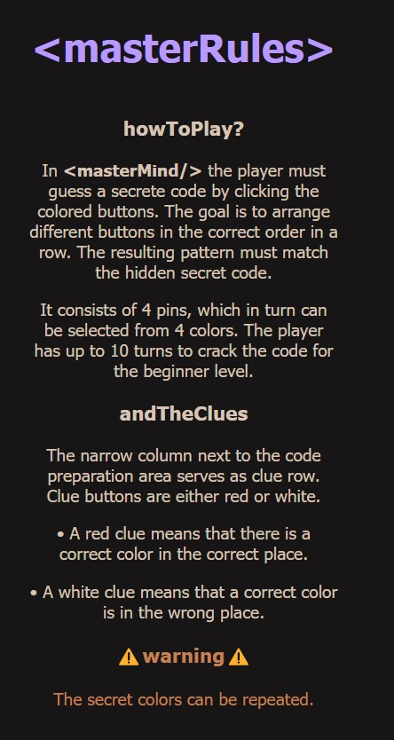
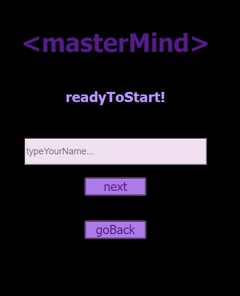
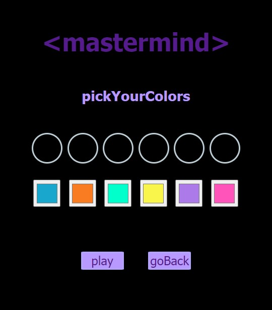
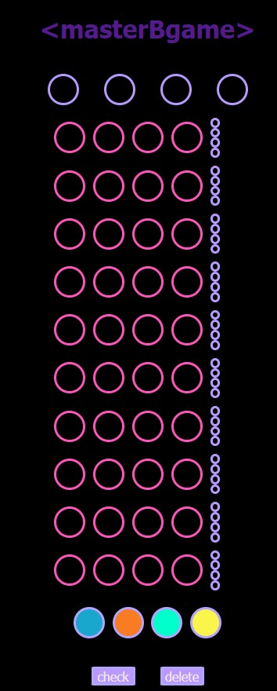

##       Tercer proyecto-juego masterMind 

Este es el tercer proyecto de mi entrenamiento como full stack developer. En este proyecto nos han pedido implementar una aplicación que permita desarrollar el juego master mind con variadas exigencias utilizando el lenguaje de programación javaScript. 
 Entre las exigencias del reto se encuentran el uso de diferentes niveles de juego con diferentes propiedades, así como la comprobación de situaciones ante los distintos escenarios del juego.  

### Proceso:
El proyecto se encuentra en proceso de elaboración, me he encontrado ante un reto bastante complejo debido a la falta de práctica/experiencia ante el nuevo lenguaje de programción exigido para desarrollo del mismo.
Para realizar el proyecto estoy utilizando HTML5,CSS3 y javaScript .
El proyecto cuenta con diferentes vistas desde las cuales se va accediendo a los diferentes tableros.

### Página Home 

### Página de instrucciones 

### Página acceso al juego

### Página nivelesdel juego

### Página selección colores-nivel experto

### Página tablero de juego-nivel principiante

#### Link al repositorio
https://github.com/martaop18/Project3-MasterMind

### Tecnologías utilizadas: 

