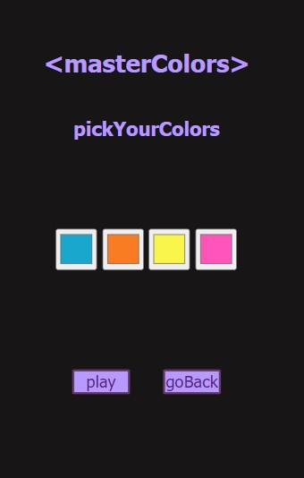

##       Tercer proyecto-juego masterMind 

Este es el tercer proyecto de mi entrenamiento como full stack developer. En este proyecto nos han pedido implementar una aplicación que permita desarrollar el juego master mind con variadas exigencias utilizando el lenguaje de programación javaScript.  

### Proceso:
Para realizar el proyecto utilicé HTML5,CSS3 y javaScript .
El proyecto cuenta con diferentes vistas desde las cuales se va accediendo al tablerode juego. Para esta entega he realizado el nivel principiante, en este nivel el jugador tiene 10 oportunidades para jugar y el código secreto se  descifrará entre los 4 colores elegidos.

## Página de instrucciones 

## Página Home 

## Página acceso al juego

## Página selección colores-nivel principiante

## Página tablero de juego-Ganador

## Página tablero de juego-Perdedor

#### Link al repositorio
https://github.com/martaop18/Project3-MasterMind

### Tecnologías utilizadas: 

